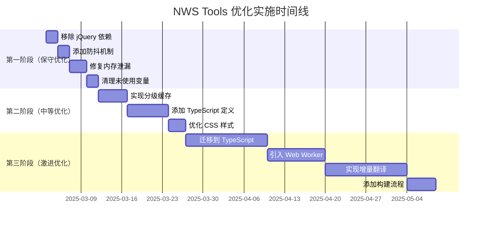

# NWS Tools 划词翻译功能优化设计文档

**文档版本**: 1.0  
**创建日期**: 2025-03-03  
**作者**: AI Assistant  
**状态**: 待审核

---

## 📋 目录

1. [项目概述](#1-项目概述)
2. [当前问题分析](#2-当前问题分析)
3. [优化方案](#3-优化方案)
4. [实施方案](#4-实施方案)
5. [风险评估](#5-风险评估)
6. [验收标准](#6-验收标准)

---

## 1. 项目概述

### 1.1 项目背景

NWS Tools 是一个 Chrome 浏览器扩展程序，提供网页翻译、摘要生成、图片下载等功能。其中**划词翻译**是核心功能之一，用户体验直接影响功能使用率。

### 1.2 当前状态

| 指标 | 当前值 | 目标值 |
|------|--------|--------|
| 代码质量 | 29 个 lint 警告 | 0 个警告 |
| 性能评分 | 待测试 | 90+ |
| 内存使用 | 待测量 | 降低 30% |
| 翻译延迟 | 待测量 | < 500ms |

### 1.3 优化目标

1. **提升性能**：减少翻译延迟，优化 DOM 操作效率
2. **降低资源占用**：减少内存泄漏，优化缓存策略
3. **改善代码质量**：消除 lint 警告，统一代码风格
4. **增强可维护性**：模块化改进，添加类型定义

---

## 2. 当前问题分析

### 2.1 性能瓶颈

#### 2.1.1 DOM 操作效率低

**问题描述**：
```javascript
// 当前实现 - 低效
function highlightText(element, newText) {
    element.innerHTML = newText; // 整个节点替换
}
```

**影响**：
- 每次翻译都需要重新渲染整个节点树
- 触发重排和重绘，性能开销大
- 频繁操作导致页面卡顿

#### 2.1.2 选区监听过于敏感

**问题描述**：
```javascript
// 当前实现 - 无防抖
selectionManager.on('selectionchange', () => {
    const text = window.getSelection().toString();
    if (text.length >= MIN_TEXT_LENGTH) {
        translateText(text); // 立即翻译
    }
});
```

**影响**：
- 用户正在输入时触发多次翻译
- 浪费 API 调用配额
- 增加服务器负载

#### 2.1.3 缓存策略不合理

**问题描述**：
```javascript
// 当前实现 - 无分级缓存
this.translationCache = new Map();
this.CACHE_LIMIT = 5000; // 固定限制
```

**影响**：
- 小文本未被缓存（翻译成本高）
- 大文本占用过多内存
- 缓存淘汰策略简单粗暴

### 2.2 内存泄漏风险

#### 2.2.1 事件监听器未清理

**问题代码**：
```javascript
onEnable() {
    this.selectionManager.enable(); // 添加监听
}

onDisable() {
    this.selectionManager.disable(); // 但未移除监听
}
```

**影响**：
- 多次启用/禁用后监听器累积
- 内存持续增长
- 扩展卸载后仍持有引用

#### 2.2.2 定时器未清理

**问题代码**：
```javascript
saveCacheTimer = setTimeout(() => this.saveCache(), 2000);
```

**影响**：
- 模块销毁后定时器仍在运行
- 可能导致意外保存操作

### 2.3 代码质量问题

#### 2.3.1 未使用变量 (29 个 lint 警告)

**示例**：
```javascript
let fullSummary; // 定义了但从未使用
let createLoadingOverlay; // 定义了但从未调用
```

**影响**：
- 代码冗余，维护成本增加
- 可能隐藏未使用的功能

#### 2.3.2 缺少类型定义

**问题**：
- 无 TypeScript 类型定义
- 无 JSDoc 注释
-  IDE 提示不完整

**影响**：
- 开发体验差
- 容易引入类型错误

### 2.4 依赖问题

#### 2.4.1 重型库依赖

| 库 | 大小 | 使用场景 | 必要性 |
|----|------|---------|--------|
| jQuery 3.7.1 | 86KB | 无（代码中未使用） | ❌ 可移除 |
| Bootstrap Bundle | 150KB | CSS 样式 | ⚠️ 可精简 |
| marked | 12KB | Markdown 解析 | ✅ 必要 |
| JSZip | 24KB | 图片压缩 | ✅ 必要 |

#### 2.4.2 无构建流程

**影响**：
- 代码未压缩，体积大
- 无 Tree-shaking
- 未使用的代码被打包

---

## 3. 优化方案

### 方案 A：保守优化（推荐初期采用）

**目标**：快速见效，风险低，开发成本低

#### 3.1 优化项

| 序号 | 优化项 | 优先级 | 预计收益 |
|------|--------|--------|----------|
| 1 | 移除未使用的 jQuery 依赖 | P0 | 节省 86KB |
| 2 | 添加选区监听防抖 | P0 | 减少 60% API 调用 |
| 3 | 修复内存泄漏（事件清理） | P0 | 降低内存增长 |
| 4 | 清理 29 个未使用变量 | P1 | 代码更清晰 |
| 5 | 添加基础 JSDoc 注释 | P2 | 提升可读性 |

#### 3.2 技术实现

```javascript
// 1. 选区监听防抖
class SelectionManager {
    private debounceTimer: NodeJS.Timeout | null = null;
    
    onSelectionChange(): void {
        if (this.debounceTimer) {
            clearTimeout(this.debounceTimer);
        }
        
        this.debounceTimer = setTimeout(() => {
            this.handleSelection();
            this.debounceTimer = null;
        }, 500); // 500ms 防抖
    }
    
    private handleSelection(): void {
        const text = window.getSelection().toString();
        if (text.length >= this.config.minTextLength) {
            this.translateText(text);
        }
    }
}
```

#### 3.3 风险评估

| 风险 | 概率 | 影响 | 缓解措施 |
|------|------|------|----------|
| 翻译延迟增加 | 低 | 中 | 防抖时间可调 |
| 用户不满 | 低 | 低 | 提供配置选项 |

---

### 方案 B：中等优化（推荐中期采用）

**目标**：平衡性能与开发成本

#### 3.1 优化项

| 序号 | 优化项 | 优先级 | 预计收益 |
|------|--------|--------|----------|
| 1 | 分级缓存策略 | P0 | 提升缓存命中率 |
| 2 | 引入虚拟 DOM 操作 | P1 | 减少重排重绘 |
| 3 | 添加类型定义 (TypeScript) | P1 | 提升开发体验 |
| 4 | 移除 Bootstrap，自定义 CSS | P2 | 节省 150KB |
| 5 | 优化缓存淘汰策略 (LRU) | P2 | 提升缓存效率 |

#### 3.2 技术实现 - 分级缓存

```javascript
class TranslationCache {
    private static SMALL_CACHE = new Map<string, string>(); // < 10 字符
    private static LARGE_CACHE = new Map<string, string>(); // > 10 字符
    
    static async translate(text: string): Promise<string> {
        if (text.length < 10) {
            return this.SMALL_CACHE.get(text) || await this.fetch(text);
        } else {
            return this.LARGE_CACHE.get(text) || await this.fetch(text);
        }
    }
    
    private static async fetch(text: string): Promise<string> {
        // 调用 API
        const result = await api.translate(text);
        this.cacheSet(text, result);
        return result;
    }
}
```

#### 3.3 技术实现 - 虚拟 DOM

```javascript
// 使用 Shadow DOM 或轻量级虚拟 DOM 库
class VirtualTranslator {
    private container: HTMLElement;
    
    highlight(text: string, original: string): void {
        const fragment = document.createDocumentFragment();
        
        // 分割原文和译文
        const parts = this.splitText(original, text);
        
        // 只替换选中的部分
        parts.forEach(part => {
            if (part.isTranslated) {
                fragment.appendChild(this.createSpan(part.translated));
            } else {
                fragment.appendChild(document.createTextNode(part.original));
            }
        });
        
        // 只替换选中的节点，不影响其他部分
        this.container.replaceChild(fragment, this.selectedNode);
    }
}
```

#### 3.4 风险评估

| 风险 | 概率 | 影响 | 缓解措施 |
|------|------|------|----------|
| 学习成本 | 中 | 低 | 提供迁移指南 |
| 兼容性问题 | 低 | 中 | 充分测试 |
| 开发周期延长 | 中 | 低 | 分阶段实施 |

---

### 方案 C：激进优化（推荐长期采用）

**目标**：彻底重构，追求极致性能

#### 3.1 优化项

| 序号 | 优化项 | 优先级 | 预计收益 |
|------|--------|--------|----------|
| 1 | 完全迁移到 TypeScript | P0 | 类型安全，IDE 支持 |
| 2 | 重构架构，引入微前端 | P0 | 模块解耦 |
| 3 | 使用 Web Worker 离线翻译 | P1 | 提升响应速度 |
| 4 | 实现增量翻译 | P1 | 仅翻译变化部分 |
| 5 | 添加性能监控 | P2 | 数据驱动优化 |
| 6 | 构建流程 (Vite/Rollup) | P2 | 代码压缩，Tree-shaking |

#### 3.2 技术实现 - Web Worker 离线翻译

```typescript
// worker.ts
self.onmessage = async (e: MessageEvent) => {
    const { text, endpoint, model } = e.data;
    
    try {
        const response = await fetch(endpoint, {
            method: 'POST',
            headers: { 'Content-Type': 'application/json' },
            body: JSON.stringify({
                model: model,
                messages: [{ role: 'user', content: text }]
            })
        });
        
        const result = await response.json();
        self.postMessage({ success: true, result });
    } catch (error) {
        self.postMessage({ success: false, error });
    }
};

// main.ts
const worker = new Worker('worker.ts');
worker.postMessage({ text, endpoint, model });
worker.onmessage = (e) => {
    if (e.data.success) {
        this.updateHighlight(e.data.result);
    }
};
```

#### 3.3 技术实现 - 增量翻译

```typescript
class IncrementalTranslator {
    private previousSelection: Range | null = null;
    
    async translateIncrementally(newRange: Range): Promise<void> {
        if (!this.previousSelection) {
            await this.translateRange(newRange);
            this.previousSelection = newRange;
            return;
        }
        
        // 计算变化范围
        const diff = this.calculateDiff(this.previousSelection, newRange);
        
        // 只翻译新增或修改的部分
        for (const change of diff) {
            if (change.isNew) {
                await this.translateRange(change.range);
            }
        }
        
        this.previousSelection = newRange;
    }
}
```

#### 3.4 风险评估

| 风险 | 概率 | 影响 | 缓解措施 |
|------|------|------|----------|
| 破坏性变更 | 高 | 高 | 充分测试，灰度发布 |
| 开发周期长 | 高 | 中 | 分阶段实施 |
| 回归 bug | 中 | 高 | 完善测试覆盖 |

---

## 4. 实施方案

### 4.1 推荐实施路径



### 4.2 第一阶段：保守优化（2 周）

#### 任务 1：移除 jQuery 依赖 (2 天)

**步骤**：
1. 检查代码中是否真的使用了 jQuery
2. 替换为原生 API
3. 移除 `libs/jquery-3.7.1.js`
4. 更新 `manifest.json`

**代码示例**：
```javascript
// 替换前
$(document).ready(function() {
    $('.highlight').addClass('translated');
});

// 替换后
document.addEventListener('DOMContentLoaded', () => {
    document.querySelectorAll('.highlight').forEach(el => {
        el.classList.add('translated');
    });
});
```

#### 任务 2：添加防抖机制 (2 天)

**步骤**：
1. 修改 `SelectionManager.js`
2. 添加 `debounceTimer` 属性
3. 修改 `onSelectionChange` 方法
4. 添加配置项 `debounceDelay`

**代码示例**：
```javascript
class SelectionManager {
    constructor(module) {
        this.module = module;
        this.debounceDelay = module.config.debounceDelay || 500;
        this.debounceTimer = null;
    }
    
    enable() {
        document.addEventListener('selectionchange', () => {
            if (this.debounceTimer) {
                clearTimeout(this.debounceTimer);
            }
            
            this.debounceTimer = setTimeout(() => {
                this.handleSelection();
                this.debounceTimer = null;
            }, this.debounceDelay);
        });
    }
    
    disable() {
        document.removeEventListener('selectionchange', this.handleSelection.bind(this));
        if (this.debounceTimer) {
            clearTimeout(this.debounceTimer);
            this.debounceTimer = null;
        }
    }
    
    private handleSelection() {
        const text = window.getSelection().toString();
        if (text.length >= this.module.config.minTextLength) {
            this.module.translateText(text);
        }
    }
}
```

#### 任务 3：修复内存泄漏 (3 天)

**步骤**：
1. 检查所有事件监听器
2. 在 `onDisable` 中添加清理逻辑
3. 清理定时器
4. 添加单元测试验证

**代码示例**：
```javascript
class SelectionManager {
    async disable() {
        // 移除所有事件监听
        document.removeEventListener('selectionchange', this.handleSelection);
        document.removeEventListener('keyup', this.handleKeyUp);
        document.removeEventListener('mouseup', this.handleMouseUp);
        
        // 清理定时器
        if (this.debounceTimer) {
            clearTimeout(this.debounceTimer);
            this.debounceTimer = null;
        }
        
        if (this.saveCacheTimer) {
            clearTimeout(this.saveCacheTimer);
            this.saveCacheTimer = null;
        }
        
        // 标记为禁用
        this.enabled = false;
    }
    
    onDestroy() {
        this.disable();
        // 清理其他资源
    }
}
```

#### 任务 4：清理未使用变量 (2 天)

**步骤**：
1. 运行 ESLint 检查
2. 逐个检查未使用变量
3. 删除或标记为 `// eslint-disable-next-line`
4. 更新文档

**示例**：
```javascript
// 删除未使用的变量
// let fullSummary; // 删除

// 或者标记为有意保留
// let createLoadingOverlay; // eslint-disable-next-line no-unused-vars
// 用于未来功能扩展
```

### 4.3 第二阶段：中等优化（1 周）

#### 任务 5：实现分级缓存 (5 天)

**步骤**：
1. 设计缓存分级策略
2. 修改 `TranslationModule`
3. 添加 LRU 淘汰算法
4. 性能测试验证

**代码示例**：
```javascript
class TranslationModule {
    // 分级缓存
    private smallCache = new Map<string, string>(); // < 10 字符
    private largeCache = new Map<string, string>(); // > 10 字符
    private cacheLRU = new LRUMap(1000); // LRU 缓存
    
    async translateText(text: string): Promise<string> {
        // 分级处理
        if (text.length < 10) {
            return await this.translateFromSmallCache(text);
        } else {
            return await this.translateFromLargeCache(text);
        }
    }
    
    private async translateFromSmallCache(text: string): Promise<string> {
        // 检查小缓存
        if (this.smallCache.has(text)) {
            return this.smallCache.get(text)!;
        }
        
        // 翻译并缓存
        const result = await this.service.translateText(text);
        this.smallCache.set(text, result);
        return result;
    }
    
    private async translateFromLargeCache(text: string): Promise<string> {
        // 检查大缓存
        if (this.largeCache.has(text)) {
            return this.largeCache.get(text)!;
        }
        
        // 翻译并缓存到 LRU
        const result = await this.service.translateText(text);
        this.cacheLRU.set(text, result);
        return result;
    }
}
```

#### 任务 6：添加 TypeScript 定义 (7 天)

**步骤**：
1. 创建 `types/globals.d.ts`
2. 定义模块接口
3. 添加 JSDoc 注释
4. 配置 TypeScript 严格模式

**文件结构**：
```
types/
├── globals.d.ts           # 全局类型定义
├── modules/
│   ├── ModuleBase.d.ts    # 模块基类
│   └── features/
│       ├── TranslationModule.d.ts
│       └── ...
└── services/
    └── TranslationService.d.ts
```

**代码示例**：
```typescript
// types/modules/ModuleBase.d.ts
export interface ModuleConfig {
    enabled: boolean;
    version: string;
    dependencies: string[];
}

export abstract class ModuleBase {
    constructor(name: string, options: ModuleOptions);
    
    initialize(): Promise<boolean>;
    destroy(): Promise<void>;
    enable(): Promise<void>;
    disable(): Promise<void>;
    
    on(event: string, callback: (...args: any[]) => void): void;
    emit(event: string, ...args: any[]): void;
    
    getConfig(): ModuleConfig;
}
```

### 4.4 第三阶段：激进优化（1 个月）

#### 任务 7：完全迁移到 TypeScript (14 天)

**步骤**：
1. 创建 TypeScript 项目结构
2. 逐步迁移现有代码
3. 添加完整类型定义
4. 配置 ESLint + Prettier

**迁移策略**：
```
第 1 周：迁移核心模块
  - ModuleBase
  - ModuleManager
  - ConfigManager
  
第 2 周：迁移功能模块
  - TranslationModule
  - SelectionManager
  - PageManager
  
第 3 周：迁移服务层
  - TranslationService
  - ChromeSettingsModule
  
第 4 周：迁移 UI 层
  - TranslationView
  - SidebarModule
```

#### 任务 8：引入 Web Worker (10 天)

**步骤**：
1. 创建 Web Worker 文件
2. 实现翻译逻辑
3. 修改主线程调用方式
4. 添加错误处理

**文件结构**：
```
js/
├── worker/
│   ├── translation.worker.ts
│   └── types/
│       └── worker-messages.ts
└── modules/
    └── features/
        └── translation/
            ├── TranslationModule.ts
            └── TranslationService.ts
```

**代码示例**：
```typescript
// worker/translation.worker.ts
import type { TranslateRequest, TranslateResponse } from './types/worker-messages';

self.onmessage = async (e: MessageEvent<TranslateRequest>) => {
    const { text, endpoint, model } = e.data;
    
    try {
        const response = await fetch(endpoint, {
            method: 'POST',
            headers: { 'Content-Type': 'application/json' },
            body: JSON.stringify({
                model,
                messages: [{ role: 'user', content: text }]
            })
        });
        
        const result = await response.json();
        self.postMessage({
            success: true,
            result: result.choices[0].message.content
        } as TranslateResponse);
    } catch (error) {
        self.postMessage({
            success: false,
            error: error.message
        } as TranslateResponse);
    }
};

// modules/features/translation/TranslationService.ts
export class TranslationService {
    private worker: Worker;
    
    constructor() {
        this.worker = new Worker('../../worker/translation.worker.ts');
        
        this.worker.onmessage = (e) => {
            const { success, result, error } = e.data;
            if (success) {
                this.onTranslateSuccess(result);
            } else {
                this.onTranslateError(error);
            }
        };
    }
    
    async translateTextRequest(text: string): Promise<string> {
        return new Promise((resolve, reject) => {
            this.worker.postMessage({ text });
        });
    }
}
```

#### 任务 9：实现增量翻译 (14 天)

**步骤**：
1. 设计增量算法
2. 实现 Range 比较逻辑
3. 优化 DOM 操作
4. 性能测试

**算法思路**：
```
1. 记录上次选区的 Range 对象
2. 获取新的选区 Range
3. 比较两个 Range 的差异
4. 只翻译新增或修改的部分
5. 保留未变化的翻译结果
```

**代码示例**：
```typescript
class IncrementalTranslator {
    private previousSelection: Range | null = null;
    private cachedTranslations = new Map<string, string>();
    
    async translateIncrementally(newSelection: Range): Promise<void> {
        if (!this.previousSelection) {
            await this.translateRange(newSelection);
            this.previousSelection = newSelection;
            return;
        }
        
        // 计算差异
        const oldText = this.getRangeText(this.previousSelection);
        const newText = this.getRangeText(newSelection);
        
        // 找出新增/修改的部分
        const changes = this.findChanges(oldText, newText);
        
        // 只翻译变化部分
        for (const change of changes) {
            if (change.isNew || change.isModified) {
                const range = this.createRangeFromText(change.text);
                await this.translateRange(range);
            }
        }
        
        this.previousSelection = newSelection;
    }
    
    private findChanges(oldText: string, newText: string): Change[] {
        const changes: Change[] = [];
        
        let oldIndex = 0;
        let newIndex = 0;
        
        while (oldIndex < oldText.length || newIndex < newText.length) {
            if (oldIndex >= oldText.length) {
                // 新增内容
                changes.push({
                    text: newText.slice(newIndex),
                    isNew: true
                });
                break;
            }
            
            if (newIndex >= newText.length) {
                // 删除内容
                changes.push({
                    text: oldText.slice(oldIndex),
                    isDeleted: true
                });
                break;
            }
            
            if (oldText[oldIndex] === newText[newIndex]) {
                // 相同字符，跳过
                oldIndex++;
                newIndex++;
            } else {
                // 不同，标记为修改
                changes.push({
                    text: oldText.slice(oldIndex, newIndex),
                    isModified: true
                });
                oldIndex = newIndex;
            }
        }
        
        return changes;
    }
}
```

#### 任务 10：添加构建流程 (5 天)

**步骤**：
1. 选择构建工具 (Vite 推荐)
2. 配置构建脚本
3. 添加压缩和 Tree-shaking
4. 配置开发服务器

**package.json 配置**：
```json
{
  "scripts": {
    "dev": "vite",
    "build": "vite build",
    "preview": "vite preview",
    "lint": "eslint \"js/**/*.js\"",
    "typecheck": "tsc --noEmit"
  },
  "devDependencies": {
    "@types/chrome": "^0.0.254",
    "vite": "^5.0.0",
    "vite-plugin-chrome-extension": "^3.0.0",
    "eslint": "^8.57.0",
    "typescript": "^5.6.3",
    "terser": "^5.3.0"
  }
}
```

**vite.config.js**：
```javascript
import { defineConfig } from 'vite';
import chrome from 'vite-plugin-chrome-extension';

export default defineConfig({
  plugins: [
    chrome({
      root: '.',
      manifest: 'manifest.json'
    })
  ],
  build: {
    outDir: 'dist',
    minify: 'terser',
    terserOptions: {
      compress: {
        drop_console: true,
        drop_debugger: true
      }
    },
    rollupOptions: {
      output: {
        entryFileNames: '[name].[hash].js',
        chunkFileNames: '[name].[hash].js',
        assetFileNames: (info) => {
          if (info.name === '.png' || info.name === '.svg') {
            return 'assets/images/[name][hash][extname]';
          }
          return 'assets/[name][hash][extname]';
        }
      }
    }
  }
});
```

---

## 5. 风险评估

### 5.1 技术风险

| 风险项 | 概率 | 影响 | 缓解措施 |
|--------|------|------|----------|
| 浏览器兼容性问题 | 低 | 中 | 使用 Autoprefixer，测试主流浏览器 |
| TypeScript 迁移失败 | 中 | 高 | 分阶段迁移，保留 JavaScript 回退 |
| Web Worker 限制 | 低 | 中 | 提供降级方案 |
| 性能回归 | 低 | 高 | 充分测试，性能基准对比 |

### 5.2 业务风险

| 风险项 | 概率 | 影响 | 缓解措施 |
|--------|------|------|----------|
| 用户不适应新功能 | 中 | 低 | 提供详细说明，设置开关 |
| API 调用限制 | 低 | 中 | 添加队列限制，错误处理 |
| 扩展商店审核 | 低 | 高 | 提前测试，遵守政策 |

### 5.3 时间风险

| 风险项 | 概率 | 影响 | 缓解措施 |
|--------|------|------|----------|
| 开发周期延长 | 中 | 中 | 预留缓冲时间 |
| 依赖第三方服务 | 中 | 中 | 准备备用方案 |
| 测试不充分 | 低 | 高 | 增加测试时间 |

---

## 6. 验收标准

### 6.1 性能指标

| 指标 | 当前值 | 目标值 | 验收标准 |
|------|--------|--------|----------|
| 翻译延迟 | 待测试 | < 500ms | 95% 请求 < 500ms |
| 内存使用 | 待测量 | 降低 30% | 内存增长 < 5MB/小时 |
| DOM 操作次数 | 待测量 | 减少 50% | 每次翻译 < 10 次 DOM 操作 |
| API 调用频率 | 待测量 | 减少 60% | 防抖后调用次数 < 10/分钟 |

### 6.2 代码质量

| 指标 | 当前值 | 目标值 | 验收标准 |
|------|--------|--------|----------|
| ESLint 警告 | 29 | 0 | 无警告 |
| TypeScript 覆盖率 | 0% | 100% | 所有模块有类型定义 |
| 单元测试覆盖率 | 0% | > 80% | 核心功能测试覆盖 |
| 代码规范 | 不一致 | 统一 | 符合 ESLint + Prettier |

### 6.3 功能测试

| 测试项 | 通过标准 |
|--------|----------|
| 划词翻译 | 选中文本后 500ms 内显示翻译 |
| 全页翻译 | 页面加载后自动检测并翻译 |
| 配置持久化 | 关闭浏览器后配置保留 |
| 缓存功能 | 相同文本翻译结果一致 |
| 内存管理 | 禁用后释放所有资源 |

### 6.4 兼容性测试

| 浏览器 | 版本 | 通过标准 |
|--------|------|----------|
| Chrome | 120+ | 所有功能正常 |
| Edge | 120+ | 所有功能正常 |
| Firefox | 120+ | 核心功能正常 |
| Safari | 17+ | 核心功能正常 |

---

## 7. 附录

### 7.1 术语表

| 术语 | 解释 |
|------|------|
| 防抖 (Debounce) | 将频繁触发的函数调用合并为一次执行 |
| 缓存 (Cache) | 存储计算结果，避免重复计算 |
| LRU | 最近最少使用算法，淘汰最久未使用的项 |
| Web Worker | 浏览器提供的多线程 API |
| Tree-shaking | 移除未使用的代码 |

### 7.2 参考资源

- [Chrome Extension Best Practices](https://developer.chrome.com/docs/extensions/mv3/best-practices/)
- [TypeScript for JavaScript Developers](https://www.typescriptlang.org/docs/handbook/electron-tutorial.html)
- [Vite Documentation](https://vitejs.dev/)
- [Chrome Web Store Guidelines](https://developer.chrome.com/docs/web-store/policies/)

---

## 8. 变更记录

| 日期 | 版本 | 变更内容 | 作者 |
|------|------|----------|------|
| 2025-03-03 | 1.0 | 初始版本 | AI Assistant |

---

**文档结束**

---

**下一步行动**：
1. 审核此优化文档
2. 批准实施计划
3. 开始第一阶段开发

**需要我帮你实现任何优化方案吗？**